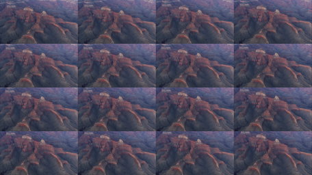

# FFMpeg Video Thumb Grid
Simple PHP tool to create thumbnail grids from video files.



## Installation
This tool requires ffmpeg.exe and ffprobe.exe, both of which can be found in [FFMpeg Website](https://www.ffmpeg.org/download.html). After downloading the files, put them in the same folder as `index.php`.

## Usage
You can use this tool directly from the browser or through the terminal by running the following command from the root folder:
```sh
$ php index.php
```

## Configuration
There are some configuration options available in the file `config.php`.
